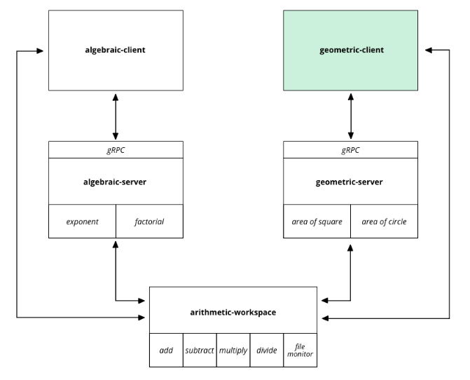

This is the `geometric-client` module from our blog post: [A full-fledged Rust architecture based on workspaces and gRPC](https://blog.nullnet.ai/blog/workspaces-grpc).

This repository contains a simple client that receives inputs from a file monitored for changes, parses such inputs,
and invokes the `geometric-server` to compute operations such as shape areas.

  <picture>
    
  </picture>

